:scrollbar:
:data-uri:
:toc2:
:linkattrs:

= Vaccine Safe Demo
:numbered:

== Purpose

To provide a reproducible demo of a vaccination attestation application that uses Red Hat technologies.

=== Technical Discussion Vectors

. *Operations*
.. Ansible for automated and repeatable deployment of Application Services to OpenShift

. *Process Automation*
.. RH-PAM embedded in SpringBoot as process automation engine
.. User Task centric process model with Task lifecycle driven by clients via KIE-Server API
.. React based simple Task Inbox web app 
.. jBPM _Executor Service_ for _asyncroneous_ tasks

. *Web Security*
.. Use of OIDC _Authorization Code Flow_ protocol between RH-SSO and Angular web app to obtain JWT based access token
.. Access token includes users roles so as to facilitate UserGroupCallback functionality in RH-PAM
.. KIE-Server APIs of RH-PAM secured via RH-SSO  as Bearer-Token endpoints

. *Polyglot Frameworks*
.. SpringBoot
.. ReactJS

== Deploy to OpenShift

Ansible based operator is included to deploy this application to OpenShift in a repeatable manner.

=== Pre-reqs

. OpenShift Container Platform version 4.7.* or more recent. Resource requirements needed by the app (doesn’t include resource requirements of Openshift to support itself) is as follows:

.. RAM: 6 GB

.. CPU: 8

.. Storage: 10 PVCs of type RWO (no RWX requirement) and each of size 5 GiB

. cluster-admin credentials to this OpenShift cluster are needed

. Corresponding oc utility installed locally
+
All versions of this utility are available at either of the following:

.. https://access.redhat.com/downloads/content/290
+
RHN subscription required

.. https://mirror.openshift.com/pub/openshift-v4/clients/ocp/?C=M;O=D
+
Accessible without a RHN subscription

=== Procedure:

. Using the oc utility that corresponds to the version of OpenShift that you will deploy to, log into the cluster:
+
-----
$ oc login <OCP API Server url> -u <cluster-admin userId> -p <passwd>
-----

. Install all needed VacSafe Operator related resources:
+
-----
$ oc apply -f
-----

.. Wait about 15 seconds
.. Notice a pod similar to the following in the _ansible-system_ namespace:
+
-----
$ oc get pod -n ansible-system

-----

. Install a VacSafe custom resource:
+
-----
$
-----

.. Deployment should complete in about 10 minutes.
.. Notice the creation of a new OCP namespace where RH-SSO is installed: _vacsafe-sso_

.. Notice the creation of a new OCP namespace where the application resides: _user1-vacsafe_

.. You can tail the log of the VACSAFE operator as follows to monitor progress:
+
-----
$ oc logs -f -n ansible-system -c manager `oc get pod -n ansible-system | grep "^ansible" | awk '{print $1}'`
-----

.. Notice the creation of a new OCP namespace where the application resides: _user1-vacsafe_

.. At the completion of the installation, expect to see messages similar to the following:
+
-----
PLAY RECAP *******************************************************************************************************************************************************************************************************
localhost                  : ok=102  changed=58   unreachable=0    failed=0    skipped=8    rescued=0    ignored=0
-----

. Optional: Uninstall from OpenShift:
+
-----
$ ansible-playbook playbooks/uninstall.yml
-----

== Demo Scenario

=== Users and Roles

. Pre-populated users (and their corresponding roles and credentials) to facilitate the demo can be found link:https://github.com/redhat-naps-da/vacsafe_demo/blob/main/ansible/resources/sso_realm/realm.json#L111-L436[here].
.. Certain users are assigned the following administrative roles:
.. *AG-COVIDSafe-Approver*
+
This role provides the authenticated user with access to the _HR Dashboard_ in the _VacSafe-UI_ web app.

.. *VacSafe-APR-<agency>*
+
This role provides the authenticated user with the ability to manage the lifecycle of administrative tasks (ie: Review Vaccination Records) in their _agency_.

. For each user listed, make note of the following:
.. *agency*
.. *password credentials*
.. *realmRoles*

=== Vacsafe UI

. From the OpenShift console, navigate to the route of the _vacsafe-ui_ application
+
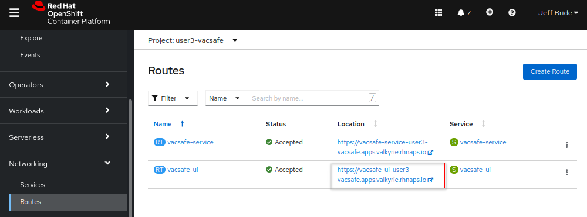

. Accept the _End User Licensing Agreement
+
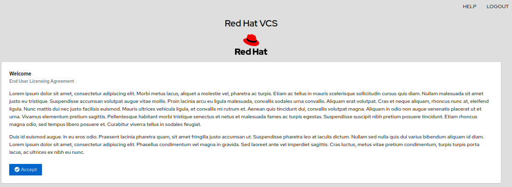

=== Submit Attestations

. From the list of link:https://github.com/redhat-naps-da/vacsafe_demo/blob/main/ansible/resources/sso_realm/realm.json#L111-L436[pre-populated users], log into the Vacsafe UI as an employee that is not an admin of their agency.
+
NOTE:  Make note of the _agency_ of that user.

. Add or adjust any of your _Profile_ fields and click _Accept_ :
+
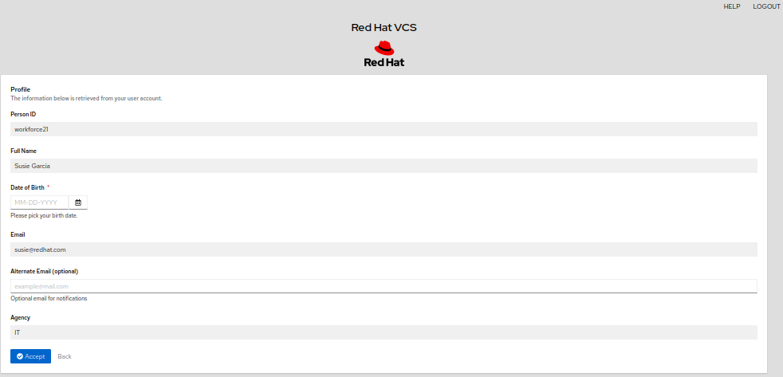

. Submit either a _Vaccination Record_ or a _COVID Test Result_
+
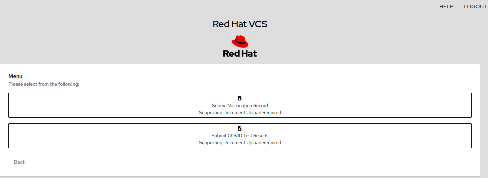

.. If submitting a Vaccination Record, ensure you have selected the Vaccine Type, the dates for the first and second (if applicable) shots and uploaded an image of your vaccination record:
+
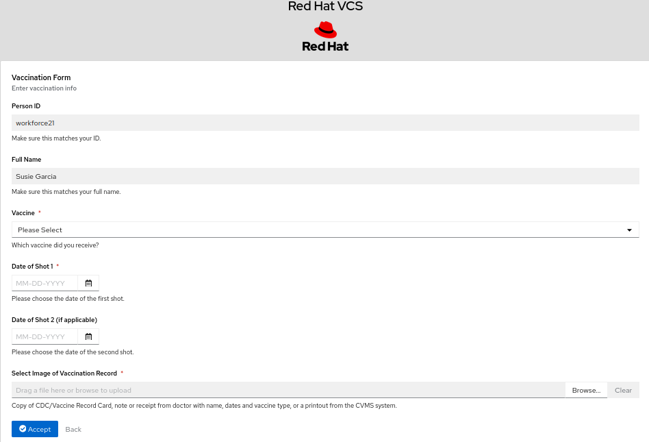

.. If submitting a Test Result, ensure you have selected the Test Results, Test Date and uploaded an image of your test result:
+
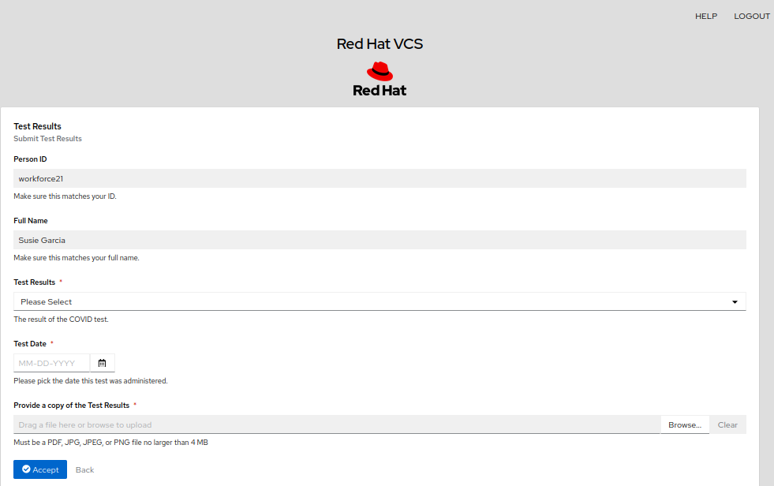

. After completion of either of the above, you'll be prompted to log out

=== Review Attestations 

. From the list of link:https://github.com/redhat-naps-da/vacsafe_demo/blob/main/ansible/resources/sso_realm/realm.json#L111-L436[pre-populated users], log into the Vacsafe UI as an admin of the same agency of the employee you just previously logged in as.
. Complete your profile as necessary and navigate to the _HR Dashboard_ page.
+
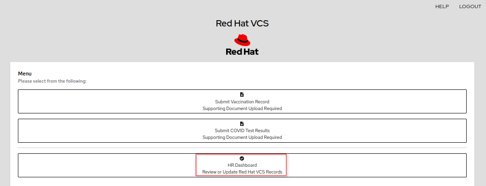

.. As an admin of an agency, you are provided with several mechanisms to review any attestations from employees in your agency.

... *Agency Inbox*
+
This approach will allow for reviewing vaccine attestation submittals:
+
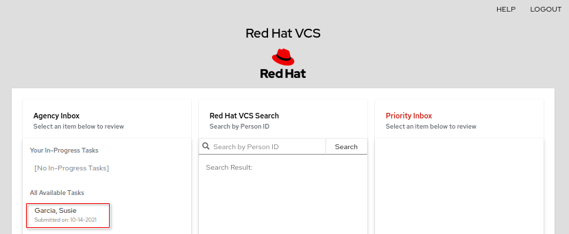

.... Select the task and review the vaccination record
.... At the bottom of the review page, _Accept_ or _Decline_ the Vaccination Record.
.... If you _Decline_ the submission, submit the most appropriate reason from the pop-up:
+
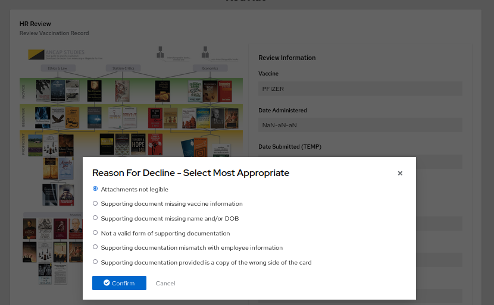

... *VCS Search*
+
This approach  will provide a complete case history list for a specific employee.

.... Locate the _workforceId_ of an employee and then search by it
+
image::docs/vsc_search.png[]

.... From the _Attestation Records_ panel, select any _Test Result_ or _Vaccination Records_ submittals for that employee.
+
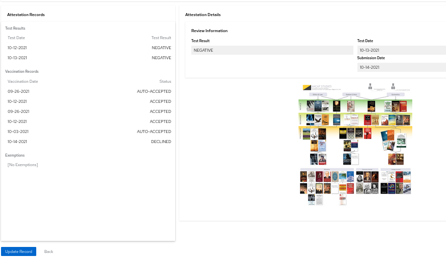

.... If needed, you can click the button at the bottom of the page to _Update Record_.
+
From the pop-up, you have the ability to update the record as a vaccine submission, test submission or grant an exception:
+
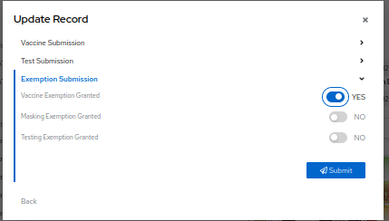

== Architecture

== APIs

The _VacSafe Service_ exposes the following categories of APIs: 

. *RH-PAM KIE-Server APIs*

. *ApiController*
+
This API allows for an HTTP POST to the following url:  $VACSAFE_SERVICE_URL/api/employee

. **

== Local Containerized environment

This project includes a _docker-compose_ config file that allows for deployment of the application as containers in your local environment.

. Start application pod with all linux containers:
+
-----
$ docker-compose -f etc/docker-compose.yaml up -d
-----
+
NOTE:  If underlying linux container system in use in your local environment is podman, then follow this link:https://fedoramagazine.org/use-docker-compose-with-podman-to-orchestrate-containers-on-fedora/[set-up guide].

. Add DNS mappings to /etc/hosts for the following two services:  _vacsafe-service_ and _sso-service_
+
-----
$ cat /etc/hosts

127.0.0.1   localhost localhost.localdomain localhost4 localhost4.localdomain4 sso-service vacsafe-service
-----

. Stop application pod with all linux containers:
+
-----
$ docker-compose -f etc/docker-compose.yaml down
-----

== Test

The purpose of this section is to provide command line based test examples.

=== Environment Variables

Set the following environment variables with values similar to the following:

. If testing locally deployed application (via docker-compose):
+
-----
RHSSO_URL=http://localhost:8080
REALM_ID=vacsafeRealm
retrieve_token_url="$RHSSO_URL/auth/realms/$REALM_ID/protocol/openid-connect/token"
VACSAFE_SERVICE_URL=http://localhost:9080
kjar_name=vacsafe-kjar
-----

. If testing environment deployed to OpenShift:
+
-----
RHSSO_URL=https://$(oc get route sso -n vacsafe-sso --template='{{ .spec.host }}')
REALM_ID=vacsafeRealm
retrieve_token_url="$RHSSO_URL/auth/realms/$REALM_ID/protocol/openid-connect/token"
VACSAFE_SERVICE_URL=https://$(oc get route vacsafe-service -n user1-vacsafe --template='{{ .spec.host }}')
kjar_name=vacsafe-kjar
-----

=== RH-SSO

. Log into _master_ realm of RH-SSO

.. If deployed in a local container environment, disable SSL requirement for master realm:
+
-----
$ podman exec -it etc_psql_sso_1 psql sso -c "update REALM set ssl_required='NONE' where id = 'master'"
-----

.. Log into _master_ realm of RH-SSO using credentials of  _master / master_ at the following URL:
+
-----
$ echo -en "\n$RHSSO_URL/auth/admin/master/console\n"
-----

. Login directly to the custom SSO realm used in the demo.  Details as follows:

.. *URL*
+
-----
$ echo -en "\n$RHSSO_URL/auth/admin/$REALM_ID/console\n"
-----

.. *userId* :  ssoRealmAdmin
.. *password* : pam

=== Vacsafe Service

The _vacsafe_service_ is enabled with an embedded RH-PAM _kieserver_ as well as various endpoints for managing documents.

. Retrieve an OAuth2 token using the `kie-server` SSO client of `vacsafeRealm`:
+
-----
TKN=$(curl -X POST "$retrieve_token_url" \
            -H "Content-Type: application/x-www-form-urlencoded" \
            -d "username=pamAdmin" \
            -d "password=pam" \
            -d "grant_type=password" \
            -d "client_id=kie-server" \
            | sed 's/.*access_token":"//g' | sed 's/".*//g')

echo $TKN

eyJhbGciOiJSUzI1NiIsInR5cCIgOiAiSldUIiwia2lkIiA6ICJOd010SUpfRnFuY3BMODJSQWRJMkMxSklLcXJWUzlBRWVNSHM0RktRZi1BIn0.eyJleHAiOjE2MTA3NjEzMzUsImlhdCI6MTYxMDc2MTAzNSwianRpIjoiOGM1YzJlZTAtMmZmZi00MGFhLTg0MGYtZWE2N2MxYWViNWZjIiwiaXNzIjoiaHR0cHM6Ly9rZXljbG9hay1yaC1zc28uYXBwcy5yaHRuY2twbWcucmhzbGVkb2NwLmNvbS9hdXRoL3JlYWxtcy9raWVSZWFsbSIsImF1ZCI6ImFjY291bnQiLCJzdWIiOiIzMmE4NjczNi04MThiLTRiM2MtODQyZi0zY2U4OGU3MjJkZGMiLCJ0eXAiOiJCZWFyZXIiLCJhenAiOiJraWUtc2VydmVyIiwic2Vzc2lvbl9zdGF0ZSI6Ijk0M2Y3NzRhLTgyOTItNDg1Mi04MmZkLWY2ZGNiMGU0NzQ0YiIsImFjciI6IjEiLCJhbGxvd2VkLW9yaWdpbnMiOlsiaHR0cHM6Ly9yaHBhbS1raWVzZXJ2ZXItcmhwYW0tZGV2LW9uY29yZS5hcHBzLnJodG5ja3BtZy5yaHNsZWRvY3AuY29tOjQ0MyIsImh0dHBzOi8vcmhwYW0ta2llc2VydmVyLXJocGFtLWRldi1vbmNvcmUuYXBwcy5yaHRuY2twbWcucmhzbGVkb2NwLmNvbSJdLCJyZWFsbV9hY2Nlc3MiOnsicm9sZXMiOlsia2llbWdtdCIsImFkbWluIiwicmVzdC1hbGwiLCJBZG1pbmlzdHJhdG9ycyIsImtpZS1zZXJ2ZXIiLCJ1c2VyIl19LCJyZXNvdXJjZV9hY2Nlc3MiOnsiYWNjb3VudCI6eyJyb2xlcyI6WyJtYW5hZ2UtYWNjb3VudCIsIm1hbmFnZS1hY2NvdW50LWxpbmtzIiwidmlldy1wcm9maWxlIl19fSwic2NvcGUiOiJwcm9maWxlIGVtYWlsIiwiZW1haWxfdmVyaWZpZWQiOmZhbHNlLCJwcmVmZXJyZWRfdXNlcm5hbWUiOiJwYW1hZG1pbiIsImVtYWlsIjoicGFtYWRtaW5Ab3BlbnNoaWZ0Lm9wZW50bGMuY29tIn0.bmHT1R25G13c4CdYK2am-5-a-Y1QwRequsXg2C55fj7kdfBr8yJ7_qRrGQxQ4spy28f3O0vdtMc10O3h3HFTPZoCaGVqfciE4axcZI2zZLdVmc6qlmfLIj-hjZMqoOB-tAYyHcFoUN9mtQmJWhCaFO0JysCUpQHeOjssSizjjRHLW5Dsg5JHqZxR4iBuG-KBlfK-cI0ryeNQV5ljdP6nNn7UrEbhHP_rFyZlmHXgOAraL6MC75Rnra0nwIvg4Wu30WXppxT7HUlQj1lFBaZQUzmFXXJBXHBq_5ofNHgervMFtmyzlG_3r892e4JS1qZ7o4fDaXyMvD1RTa6WwKpC8g
-----

. By setting _fullScopeAllowed=true_ in SSO client, all roles assocated with an authenticated user will be included in the access token.
+
These roles can be visualized as follows:
+
-----
$ jq -R 'split(".") | .[1] | @base64d | fromjson' <<< $TKN | jq .realm_access.roles

[
  "interviewer",
  "kie-server",
  "user"
]
-----

. Using the OAuth2 token, invoke the kie-server to determine its current status:
+
-----
$ curl -v \
    -H "Authorization: Bearer $TKN" \
    -X GET \
    -H 'Accept:application/json' \
    $VACSAFE_SERVICE_URL/rest/server
-----

. Health Check Report
+
-----
$ curl -H "Authorization: Bearer $TKN" -H 'Accept:application/json' $VACSAFE_SERVICE_URL/rest/server/healthcheck?report=true
-----

. View KIE-Server Swagger
+
-----
$ curl -v -H "Authorization: Bearer $TKN" $VACSAFE_SERVICE_URL/rest/swagger.json | jq .
-----

. View KIE-Server Swagger UI
+
Point your browser to the output of the following:
+
-----
$ echo -en "\n$VACSAFE_SERVICE_URL/rest/api-docs?url=$VACSAFE_SERVICE_URL/rest/swagger.json\n"
-----
+
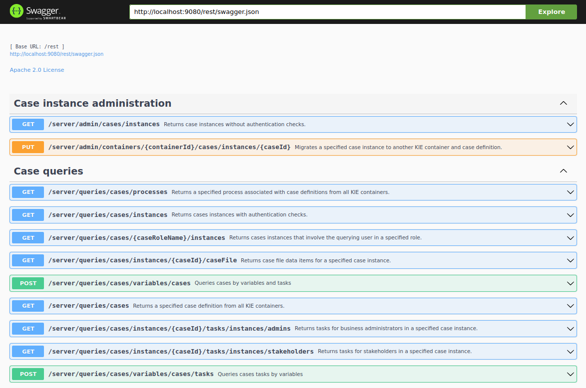

. View OpenAPI Docs for SpringBoot based RESTful APIs:
+
-----
$ curl -v -H "Authorization: Bearer $TKN" $VACSAFE_SERVICE_URL/v3/api-docs | jq .
-----

. View Swagger UI for SpringBoot based RESTful APIs:
+
Point your browser to the output of the following:
+
-----
$ echo -en "\n$VACSAFE_SERVICE_URL/swagger-ui.html\n"
-----
+
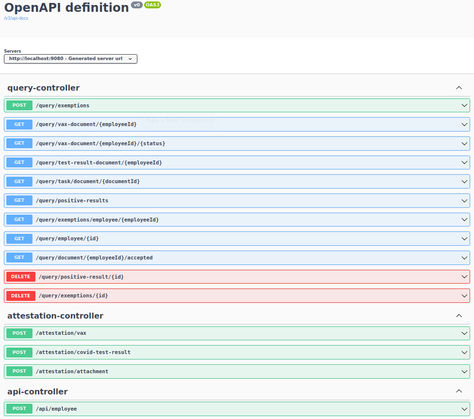

. List KIE Containers
+
-----
$ curl -H "Authorization: Bearer $TKN" -X GET $VACSAFE_SERVICE_URL/rest/server/containers
-----

. List process definitions in JSON representation:
+
-----
$ curl -H "Authorization: Bearer $TKN" -X GET -H 'Accept:application/json' $VACSAFE_SERVICE_URL/rest/server/containers/$kjar_name/processes/
-----

. Start Test Result Submission Workflow
+
-----
$ curl -v -H "Authorization: Bearer $TKN" \
       -X POST \
       -H 'Content-Type:application/json' \
       $VACSAFE_SERVICE_URL/rest/server/containers/$kjar_name/processes/covid_test_result_submission_workflow/instances \
       -d @vacsafe-service/src/test/resources/testdata/CovidTestResultDocument_POSITIVE.json
-----

== Demo Development

. Build and start vacsafe app :
+
-----
$ mvn clean package -DskipTests && \
         java \
           -Dorg.kie.server.repo=../etc/vacsafe-service/runtime_configs \
           -jar target/vacsafe-service-0.0.1.jar                                 &> /tmp/vacsafe-service.log & 
-----

. Unit Tests
+
-----
$ mvn clean test \
     -Daws.accessKeyId=$AWS_ACCESS_KEY_ID \
     -Daws.secretAccessKey=$AWS_SECRET_ACCESS_KEY
-----

== Appendix

=== Valkyrie

. link://https://vacsafe-ui-user3-vacsafe.apps.valkyrie.rhnaps.io/[Vacsafe-UI] 

=== Bug List

=== Operator Notes

=== Reference
. link:https://sdk.operatorframework.io/docs/building-operators/ansible/tutorial/[ansible operator tutorial]

. link:https://quay.io/repository/redhat_naps_da/vacsafe-operator?tab=tags[VacSafe Operator Image Tags]

=== Development

==== Base Operator
. Modify Makefile (as needed)
. Build image and deploy to quay:
+
-----
$ make docker-build docker-push
-----

. Deploy operator in OpenShift cluster:
+
-----
$ make deploy
----

. Install VACSAFE resource
+
-----
$ oc apply -f config/samples/cache_v1alpha1_vacsafe.yaml -n ansible-system
-----

. Acquire needed configs for use in RHPDS:
+
-----
$ mkdir rhpds
$ ./bin/kustomize build config/default > rhpds/vacsafe-operator-all-configs.yml
$ cp config/samples/cache_v1alpha1_vacsafe.yaml rhpds/
-----

. Clone the source code of this project:
+
-----
$ git clone https://github.com/redhat-naps-da/vacsafe_demo
-----

. Change to the ansible directory of this project:
+
-----
$ cd vacsafe_demo/ansible
-----

. Deploy to OpenShift:
+
-----
$ ansible-playbook playbooks/install.yml
-----

